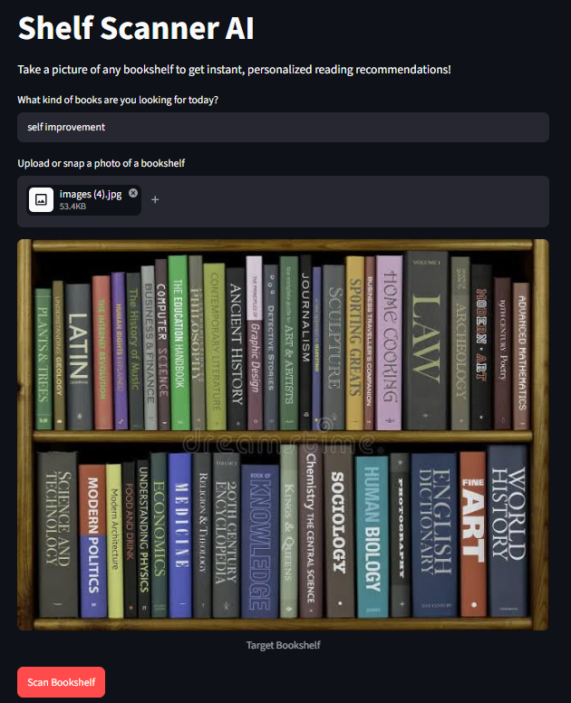
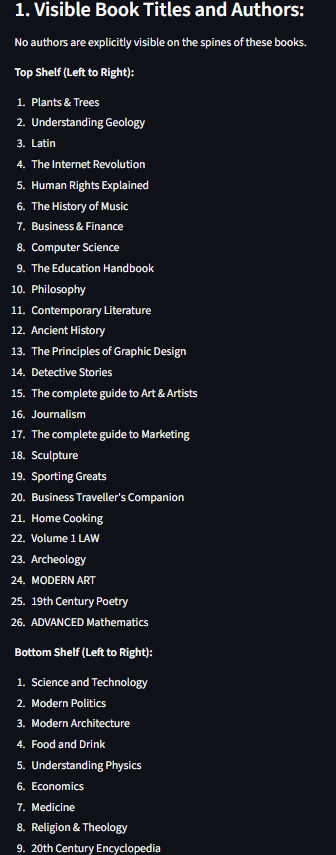
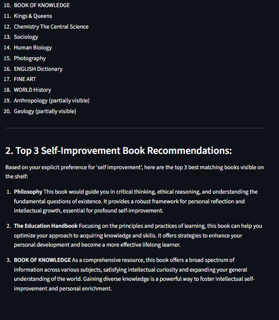

# 🛒 Shelf Scanner AI

[](https://github.com/sathishasmi/shelf-scanner-ai/actions)

> **Live Demo (Frontend):** [https://shelf-scanner-ai.streamlit.app](https://shelf-scanner-ai.streamlit.app)  
> **Production API (Backend):** [https://shelf-scanner-ai.onrender.com](https://shelf-scanner-ai.onrender.com)

An end-to-end Multimodal Vision AI bookshelf scanner built with FastAPI, Streamlit, Google Gemini 2.5 Flash, and Pillow.

---

## 📝 Overview
Shelf Scanner AI analyzes a physical bookshelf image, automatically extracts visible book titles and authors using multi-modal context, and recommends the best matching books based on a user's semantic reading preference.

## ⚡ Features
* **Multimodal Vision Processing:** Leverages Gemini 2.5 Flash to simultaneously extract book spine text and perform contextual recommendations without requiring a separate heavy OCR pipeline.
* **Production-Grade Latency Control:** Integrates a Pillow image preprocessing layer to downscale heavy smartphone images before transmitting payloads over the network, mitigating cloud API timeouts.
* **Decoupled Architecture:** Features a clean separation of concerns with an independent presentation layer (Streamlit) and a core backend server gateway (FastAPI).
* **Automated MLOps CI/CD Pipeline:** Configured with GitHub Actions to automatically run tests and trigger continuous deployments directly to Render upon every push to the `main` branch.

---

## 📸 User Interface & Demo

| Upload & Analysis Interface | Results View 1 | Results View 2 |
| :---: | :---: | :---: |
|  |  |  |
---

## 🏗️ System Architecture
``` text
User ➔ Streamlit UI ➔ FastAPI Gateway ➔ Pillow Optimization ➔ Gemini 2.5 Flash ➔ Structured Output
```

## 📂 Project Structure

```text
shelf-scanner-ai/
│
├── .github/
│   └── workflows/
│       └── deploy.yml              # GitHub Actions CI/CD pipeline
│
├── app/
│   │
│   ├── frontend/
│   │   └── app.py                  # Streamlit user interface
│   │
│   ├── services/
│   │   ├── gemini_service.py       # Gemini AI recommendation engine
│   │   ├── image_service.py        # Image preprocessing & optimization
│   │   └── __init__.py
│   │
│   │
│   ├── config.py                   # Environment variables & configuration
│   ├── main.py                     # FastAPI backend entry point
│   └── __init__.py
│
├── .env                            # Local environment variables (ignored)
├── .gitignore                      # Git ignore rules
├── .python-version                 # Python version specification
├── requirements.txt                # Python dependencies
└── README.md                       # Project documentation
```

## Installation


1. Establish a Virtual Environment:
``` bash
python -m venv .venv
```

2. Activate the environment depending on your operating system:
``` bash
Windows (Command Prompt): .venv\Scripts\activate
Windows (PowerShell): .\venv\Scripts\Activate.ps1
Mac/Linux: source .venv/bin/activate
```

3. Install Dependencies:
``` bash
pip install -r requirements.txt
```

4. Configure Your API Environment:

* Create a .env file in the root directory:
``` bash
GEMINI_API_KEY=YOUR_SECRET_GOOGLE_AI_STUDIO_KEY
```

## Running the Application


Start the Backend Engine (Terminal 1):

``` bash
uvicorn app.main:app --reload

* API Health Check Checkpoint: `http://127.0.0.1:8000/health`
* Interactive Swagger UI Docs: `http://127.0.0.1:8000/docs`
```
Start the Frontend Interface (Terminal 2):

``` bash
streamlit run app/frontend/app.py

* User Interface Link: `http://localhost:8501`
```

## API Specification
POST /api/v1/scan
- Processes incoming multipart form data payloads.

    + Form Fields: - file: Binary image stream data (JPEG/PNG)

      + preferences: Text description of user reading alignment goals

    + Returns: JSON object containing curated recommendations string.

## Workflow

1.  Upload image
2.  Enter preference
3.  Optimize image
4.  Analyze with Gemini
5.  Display recommendations

## Future Improvements

-   Build responsive book cover thumbnail UI cards using web-scraping   book APIs.
-   Containerize the entire execution setup via multi-stage Dockerfile layers.
-   Add JWT-based user authorization middleware security protocols.

## Author
Satheesh
